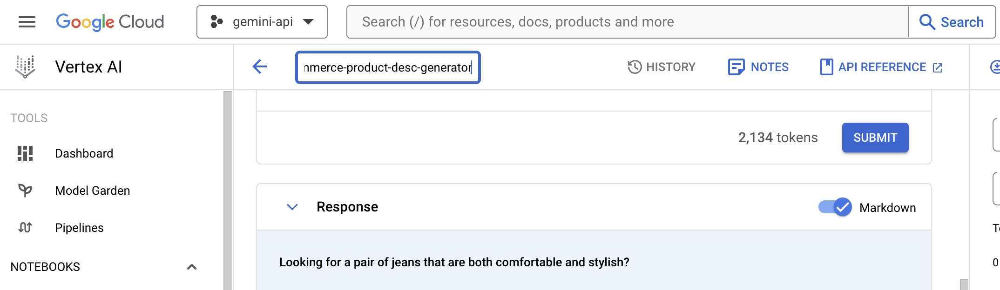

# Gemini Workshop - E-commerce product description generator

A workshop using Google's Gemini LLM to build an e-commerce product description generator (for Build With AI event series).

## Gemini LLM

Gemini is a family of multimodal large language models developed by Google DeepMind. Unlike other LLMs, Gemini was said to be unique in that it was not trained on a text corpus alone and was designed to be multimodal, meaning it could process multiple types of data simultaneously, including text, images, audio, video, and computer code. - [Source](https://en.wikipedia.org/wiki/Gemini_(language_model))

## Vertex AI

Vertex AI is a fully-managed, unified AI development platform for building and using generative AI. Access and utilize AI Studio, Agent Builder, and 130+ foundation models including Gemini 1.5 Pro—all from Vertex AI. - [Source](https://cloud.google.com/vertex-ai?hl=en)

## E-commerce product description generator

The goal of this workshop is to build an E-commerce product desciption generator focues on fashion e-commerce products. The usual process for many products that are published on a ecommerce website is, photos are taken for each product in a studio genearlly with a model wearing it.

With the photos of the product (with or without a model) and the product's description which includes brand, material, wash instructions etc a copywriter writes descriptioin for each product. Then it goes through a copy edit process and finally when the product is published on the website the product description is also included in it. Below is a sample product description of a women's Jeans by Guess (possibly written by a human)


This workshop is about automating the process, where the copywriter (or someone else), will upload the photos and ask Gemini to generate a product description. The photos used in this workshop are right free images by [Dmitriy Steinke](https://www.pexels.com/photo/model-in-a-white-t-shirt-and-jeans-17542870/) found on Pexels.

## Steps for the workshop

To begin, you will need to have the following pre-requisites sorted:

1. Have a working Google Cloud account (with some credit)
1. Turn on Vertex AI APIs
1. Cloned this repository on your machine, for the product images.


### Steps to create the e-commerce product description generator

1. Create a new project on your Google Cloud console called `gemini-try`.
2. Go to Vertex AI from your Google Cloud Console, the easiest way to do it would be to search for `vertex` on the search bar as seen below:


 3. Click on `Vertex AI`
 4. On the Vertex AI page, click on `Multimodal` found on the left menu


 5. On the Multimodal page, click `Open` on the "Prompt design (single turn)" box as follows:


6. On the Prompt experiment page, paste the following prompt in the `Prompt` text box:

```
As an expert e-commerce copywriter, analyze the uploaded images of women's jeans and write a product description for a low to mid-end fashion e-commerce website. Please include the details about the comfortable to wear jeans and do not include any details about the price. Make sure that the copy is written in an engaging and friendly tone.
```

7. Then upload the images you find in this repository's `womens-jeans-photos` folder by clicking the `Insert Media` option on the right side of the `Prompt` textbox. Once all the 8 images are uploaded, it will look something like the below:


8. After that hit the `Submit` button to test out the prompt with the uploded images, you should get a response similar to the following:

 

9. At this point, it would be a good idea to save your prompt (with images). To do this, click the `pen` icon besides `Untitled prompt` above the prompt text box and type `e-commerece-product-desc-generator` the click anywhere, it will look like the below while editing:



10. Save prompt - choose reason (US central 1)

11. Hurray! The basic e-commerce product description generator is working. Now, you will do some more tweaks to the setting to make it better.

IMAGE - Temprature, output limit, top k, top p

12. It is also important to set up the `Safety Settings` correctly as per your usecase, for now we will set it at maximum safety (Responsibel AI). 

IMAGE - block all

13. You can also tweak the prompt text to make it better.

IMAGE

14. Generate Node.js code

IMAGE - get code

15. Save the code in a index.js file

16. Run the code to test it out (npm install, etc)

17. Misc, go back to saved prompts
