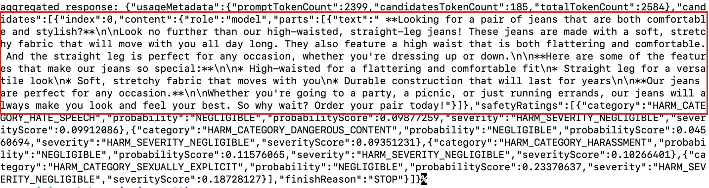

# Gemini Workshop - E-commerce product description generator

A workshop using Google's Gemini LLM to build an e-commerce product description generator (for the Build With AI event series).

## Gemini LLM

Gemini is a family of multimodal large language models developed by Google DeepMind. Unlike other LLMs, Gemini was said to be unique in that it was not trained on a text corpus alone and was designed to be multimodal, meaning it could process multiple types of data simultaneously, including text, images, audio, video, and computer code. - [Source](https://en.wikipedia.org/wiki/Gemini_(language_model))

## Vertex AI

Vertex AI is a fully-managed, unified AI development platform for building and using generative AI. Access and utilize AI Studio, Agent Builder, and 130+ foundation models including Gemini 1.5 Pro—all from Vertex AI. - [Source](https://cloud.google.com/vertex-ai?hl=en)

## E-commerce product description generator

The goal of this workshop is to build an E-commerce product description generator that focuses on fashion e-commerce products. The usual process for many products that are published on an e-commerce website is, that photos are taken for each product in a studio generally with a model wearing it.

With the photos of the product (with or without a model) and the product's description which includes brand, material, wash instructions, etc a copywriter writes a description for each product. Then it goes through a copy edit process and finally, when the product is published on the website the product description is also included in it. Below is a sample product description of women's Jeans by Guess (possibly written by a human)


This workshop is about automating the process, where the copywriter (or someone else), will upload the photos and ask Gemini to generate a product description. The photos used in this workshop are right free images by [Dmitriy Steinke](https://www.pexels.com/photo/model-in-a-white-t-shirt-and-jeans-17542870/) found on Pexels.

## Steps for the workshop

To begin, you will need to have the following pre-requisites sorted:

1. Have a working Google Cloud account (with some credit)
1. Turn on Vertex AI APIs
1. Cloned this repository on your machine, for the product images.


### Steps to create the e-commerce product description generator

1. Create a new project on your Google Cloud console called `gemini-ecomm` or anything relevant.

2. Go to Vertex AI from your Google Cloud Console, the easiest way to do it would be to search for `vertex` on the search bar as seen below:


 3. Click on `Vertex AI`

 4. On the Vertex AI page, click on `Multimodal` found on the left menu


 5. On the Multimodal page, click `Open` on the "Prompt design (single turn)" box as follows:


6. On the Prompt experiment page, please make sure you have the `gemini-1.0-pro-vision-001` model selected. Then, paste the following prompt in the `Prompt` text box:

```text
As an expert e-commerce copywriter, analyze the uploaded images of
women's jeans and write a product description for a low to mid-end 
fashion e-commerce website. Please include the details about the 
comfortable to wear jeans and do not include any details about the 
price. Make sure that the copy is written in an engaging and friendly tone.
```

7. Then upload the images you find in this repository's `womens-jeans-photos` folder by clicking the `Insert Media` option on the right side of the `Prompt` textbox. Once all the 8 images are uploaded, it will look something like the below:


8. After that hit the `Submit` button to test out the prompt with the uploaded images, you should get a response similar to the following:

 

9. At this point, it would be a good idea to save your prompt (with images). To do this, click the `pen` icon beside `Untitled prompt` above the prompt text box, then type `e-commerce-product-desc-generator` the click anywhere, it will look like the below while editing:


10. As you have named the prompt, you can save it. To save the prompt click `Save` on the top left part of the right sidebar as shown below:


11. Then select the region (it is ok to choose us-central1) on the overlay window and save the prompt.


All saved prompts will be accessible in your [My Prompts](https://console.cloud.google.com/vertex-ai/generative/multimodal/my-prompts?hl=en-AU) page.


12. Hurray! The basic e-commerce product description generator is working. Now, you will change some settings to make it better. You can go back to the prompt editing page by clicking the `Prompt Name` if you are on the `My Prompts` page.

13. In terms of configurations, for Gemini 1.0 pro vision there are 4 options you can configure. Those four are explained in plain words below:

* **Temperature (Randomness/Creativity/Spice)**: Imagine a roulette wheel (randomness). A high temperature increases the spin's randomness, affecting the chosen word (output).

* **Output Token Limit (Length)**: This is like a set word limit (length) for your text. It controls how many words the LLM generates in total.

* **Top K (Choice)**: Think of this as picking from a shortlist (choice) of the most likely words. A lower K restricts the options for the next word.

* **Top P (Probability)**: This is like a probability wheel (probability). It influences the LLM to pick the next word based on its likelihood (probability), not just being the most likely.

Below is a configuration you can try out, the right settings for this configuration depend on how you want the output to be shaped by Gemini:


14. It is also important to set up the `Safety Settings` correctly as per your use case, for now, we will set it at maximum safety (Responsible AI). As seen below, the safety settings (found on the right sidebar are self-explanatory)


15. You can also tweak the prompt text to make it better, below is another version of the prompt:

```
As an expert e-commerce copywriter, analyze the uploaded images of women's
jeans and write a product description for a low to mid-end fashion e-commerce
website. Please include the details about the comfortable to wear clothing and
do not include any details about the price. Make sure that the copy is written
in an engaging and direct tone. 
```

You can play around with the prompt and make it more flexible or more specific as per your goals.

---

The optional code step below, needs Node.js installed

---

16. Generate code (Node.js)

If you want to create an API for the e-commerce description generator or want to have more control over what the LLM is called, you can generate code and run it on a Google Cloud Platform service like Google Cloud Run. To generate code, click the `<> Get Code` link which shows a slider on the right side as follows:


For this workshop, you will use the Node.js code and try it out.

17. Save the code in an index.js file

To save the code click `Node.js` and copy the code into a file called `index.js`


Then run `npm init -y` on that folder to initialize a Node.js project. After that run `npm install @google-cloud/vertexai`.  Consequently run `gcloud auth application-default login`, then login to your Google Cloud account.

18. Run the code to test it out

To test the code, run `node index.js`, which will result in an output like the below:



19. Further steps

The generated code is more like a proof of concept. You can add an API layer and UI on top of it to make it more useful. For instance below is a basic UI generated with [v0](https://v0.dev/r/iP3BVQiLBa5) with the prompt:

```
An internal tool for e-commerce websites to generate product descriptions,
it will have a product name text box, multi-file upload field, category
select box with clothes, shoes, accessory options, gender select box
with male, female, and unisex options and age select box with infants,
kids, teens, and adults options. Then a button that says Generate.
```

The UI is below:


Thank you!
