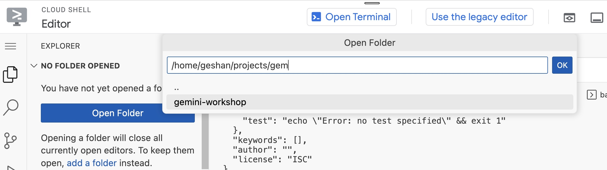
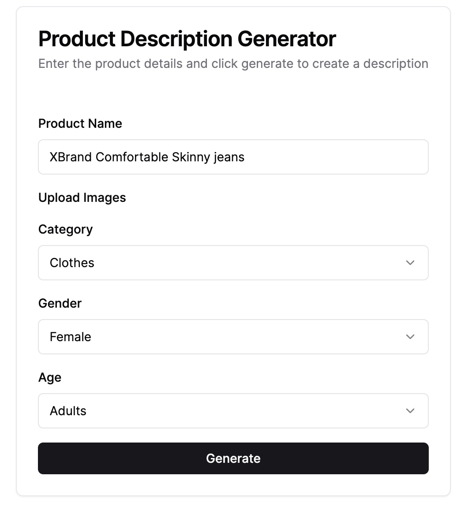

# Gemini Workshop - E-commerce product description generator

A workshop using Google's Gemini LLM to build an e-commerce product description generator (for the Build With AI event series).

## Gemini LLM

Gemini is a family of multimodal large language models developed by Google DeepMind. Unlike other LLMs, Gemini was said to be unique in that it was not trained on a text corpus alone and was designed to be multimodal, meaning it could process multiple types of data simultaneously, including text, images, audio, video, and computer code. - [Source](https://en.wikipedia.org/wiki/Gemini_(language_model))

## Vertex AI

Vertex AI is a fully-managed, unified AI development platform for building and using generative AI. Access and utilize AI Studio, Agent Builder, and 130+ foundation models including Gemini 1.5 Pro—all from Vertex AI. - [Source](https://cloud.google.com/vertex-ai?hl=en)

## E-commerce product description generator

The goal of this workshop is to build an E-commerce product description generator that focuses on fashion e-commerce products. The usual process for many products that are published on an e-commerce website is, that photos are taken for each product in a studio generally with a model wearing it.

With the photos of the product (with or without a model) and the product's description which includes brand, material, wash instructions, etc a copywriter writes a description for each product. Then it goes through a copy edit process and finally, when the product is published on the website the product description is also included in it. Below is a sample product description of women's Jeans by Guess (possibly written by a human):

<details>
<summary>Guess Jeans' product description</summary>


</details>

This workshop is about automating the process, where the copywriter (or someone else), will upload the photos and ask Gemini to generate a product description. The photos used in this workshop are right free images by [Dmitriy Steinke](https://www.pexels.com/@dmitriy-steinke-559643503/) from Pexels.

---

## Steps for the workshop

To begin, you will need to have the following pre-requisites sorted:

1. Have a working Google Cloud account (with some credit)
1. Cloned/downloaded [the](https://github.com/geshan/gemini-workshop) repository on your machine, for the product images.

Please be aware of the [Vertex AI Pricing](https://cloud.google.com/vertex-ai/generative-ai/pricing) as well.

### Steps to create the e-commerce product description generator

Below are the steps to create a e-commerce product description generator:

#### Vertex AI on GCP

1. Go to you Google Cloud Console and [Create a new project](https://console.cloud.google.com/projectcreate) called `gemini-ecomm` or anything relevant as seen below:

<details>
<summary>New project</summary>


</details>

2. Make sure you have selected the project created in step 1 if you have multiple projects.

3. Go to Vertex AI from your Google Cloud Console, the easiest way to do it would be to search for `vertex` on the search bar as seen below:

<details>
<summary>Search bar</summary>


</details>

4. Click on `Vertex AI`

5. On the Vertex AI page, then "Enable all recommended APIs" as seen below (it will take some time):

<details>
<summary>Enable APIs</summary>


</details>

6. After then APIs are enabled, click on `Multimodal` found on the left menu

<details>
<summary>Multimodal</summary>


</details>

7. On the Multimodal page, click `Open` on the "Prompt design (single turn)" box as follows:

<details>
<summary>Prompt Design</summary>


</details>

#### Prompting

8. On the Prompt experiment page, please make sure you have the `gemini-1.0-pro-vision-001` model selected. Then, paste the following prompt in the `Prompt` text box:

<details>
<summary>The Prompt</summary>

```text
As an expert e-commerce copywriter, analyze the uploaded images of
women's jeans and write a product description for a low to mid-end 
fashion e-commerce website. Please include the details about the 
comfortable to wear jeans and do not include any details about the 
price. Make sure that the copy is written in an engaging and friendly tone.
```

</details>

9. Then upload the images you find in this repository's `womens-jeans-photos` folder by clicking the `Insert Media` option on the right side of the `Prompt` textbox. Once all the 8 images are uploaded, it will look something like the below:

<details>
<summary>Prompt Ready</summary>


</details>

10. After that hit the `Submit` button to test out the prompt with the uploaded images, you should get a response similar to the following:

<details>
<summary>Prompt Working</summary>


</details>

#### Name and save the prompt

11. At this point, it would be a good idea to save your prompt (with images). To do this, click the `pen` icon beside `Untitled prompt` above the prompt text box, then type `e-commerce-product-desc-generator` the click anywhere, it will look like the below while editing:

<details>
<summary>Name the prompt</summary>


</details>

12. As you have named the prompt, you can save it. To save the prompt click `Save` on the top left part of the right sidebar as shown below:

<details>
<summary>Save Prompt button</summary>


</details>

13. Then select the region (it is ok to choose us-central1) on the overlay window and save the prompt.

<details>
<summary>Save Prompt options</summary>


</details>

All saved prompts will be accessible in your [My Prompts](https://console.cloud.google.com/vertex-ai/generative/multimodal/my-prompts?hl=en-AU) page.

<details>
<summary>My Prompts</summary>


</details>

14. Hurray! The basic e-commerce product description generator is working. Now, you will change some settings to make it better. You can go back to the prompt editing page by clicking the `Prompt Name` if you are on the `My Prompts` page.

#### Gemini configurations

15. In terms of configurations, for Gemini 1.0 pro vision there are 4 options you can configure. Those four are explained in plain words below:

<details>
<summary>LLM Config params</summary>

* **Temperature (Randomness/Creativity/Spice)**: Imagine a roulette wheel (randomness). A high temperature increases the spin's randomness, affecting the chosen word (output).

* **Output Token Limit (Length)**: This is like a set word limit (length) for your text. It controls how many words the LLM generates in total.

* **Top K (Choice)**: Think of this as picking from a shortlist (choice) of the most likely words. A lower K restricts the options for the next word.

* **Top P (Probability)**: This is like a probability wheel (probability). It influences the LLM to pick the next word based on its likelihood (probability), not just being the most likely.

</details>

Below is a configuration you can try out, the right settings for this configuration depend on how you want the output to be shaped by Gemini:

<details>
<summary>Gemini Params</summary>


</details>

16. It is also important to set up the `Safety Settings` correctly as per your use case, for now, we will set it at maximum safety (Responsible AI). As seen below, the safety settings (found on the right sidebar are self-explanatory)

<details>
<summary>Gemini Safety Settings</summary>


</details>

17. You can also tweak the prompt text to make it better, below is another version of the prompt:

<details>
<summary>Another Prompt</summary>

```
As an expert e-commerce copywriter, analyze the uploaded images of women's
jeans and write a product description for a low to mid-end fashion e-commerce
website. Please include the details about the comfortable to wear clothing and
do not include any details about the price. Make sure that the copy is written
in an engaging and direct tone.
```

</details>

You can play around with the prompt and make it more flexible or more specific as per your goals.

---

The optional code step below.

---

#### Generate Node.js Code

18. If you want to create an API for the e-commerce description generator or want to have more control over what the LLM is called, you can generate code and run it on a Google Cloud Platform service like Google Cloud Run. To generate code, click the `<> Get Code` link which shows a slider on the right side as follows:

<details>
<summary>Default generated code (Python)</summary>


</details>

For this workshop, you will use the Node.js code and try it out. For that you will use Cloud shell and Cloud shell editor.

19. Click `Activate Cloud Shell` toward the top right corner of the screen as seen below:


20. In the Cloud shell window, click `Open Editor`:


21. This will take some time and open up the Google Cloud Shell Editor which looks very similar to VS Code. In the Editor click `Hamburger Menu > Terminal > New Terminal` as follow:


22. In the editor's teminal, execute `mkdir projects && cd projects && mkdir gemini-workshop && cd gemini-workshop`, after that run `npm init -y` as follow:


23. Then, run `npm install @google-cloud/vertexai` to install vertext AI NPM package:


24. After that you will load the folder in the project, go to `Hamburger Menu > File > Open Folder`:


25. Then type in `projects/gem` and select the `gemini-workshop` option and click `OK`:



26. It will load the folder on the Cloud Shell editor, after that, to add a new file click the `file+` icon besides `GEMINI-WORKSHOP` and name it `index.js`


27. For the contents of the index.js, click `<>GET CODE` on the Vertex AI Editor screen, then code click `Node.js` and copy the code into a file called `index.js`


28. Paste the code in the `index.js` empty file and save it:


29. To run the code and test it out, again open the terminal from `Hamburger Menu > Terminal > New Terminal` and type in `node index` then hit enter. It will ask you to `Authorise`:


After authorisation the code will run and give an outupt like the below:


Congrats! You are a Gemini and Vertex AI novice now :). You can close the Cloud Shell Editor.

#### What's next

30. Further steps

The generated code is more like a proof of concept. You can add an API layer and UI on top of it to make it more useful. You can deploy that API on Google Cloud Run as serverelss containers.

For instance below is a basic UI generated with [v0](https://v0.dev/r/iP3BVQiLBa5) with the prompt:

<details>
<summary>Prompt to generate UI on V0</summary>

```
An internal tool for e-commerce websites to generate product descriptions,
it will have a product name text box, multi-file upload field, category
select box with clothes, shoes, accessory options, gender select box
with male, female, and unisex options and age select box with infants,
kids, teens, and adults options. Then a button that says Generate.
```

</details>

The UI is below:

<details>
<summary>Simple UI generated by V0</summary>



</details>

31. It would be good idea to read more about LLMs in general and also about Gemini. You can also do course or code labs about [Gemini on Cloud Skills boost](https://www.cloudskillsboost.google/catalog?keywords=gemini&page=1) platform.

Thank you!
